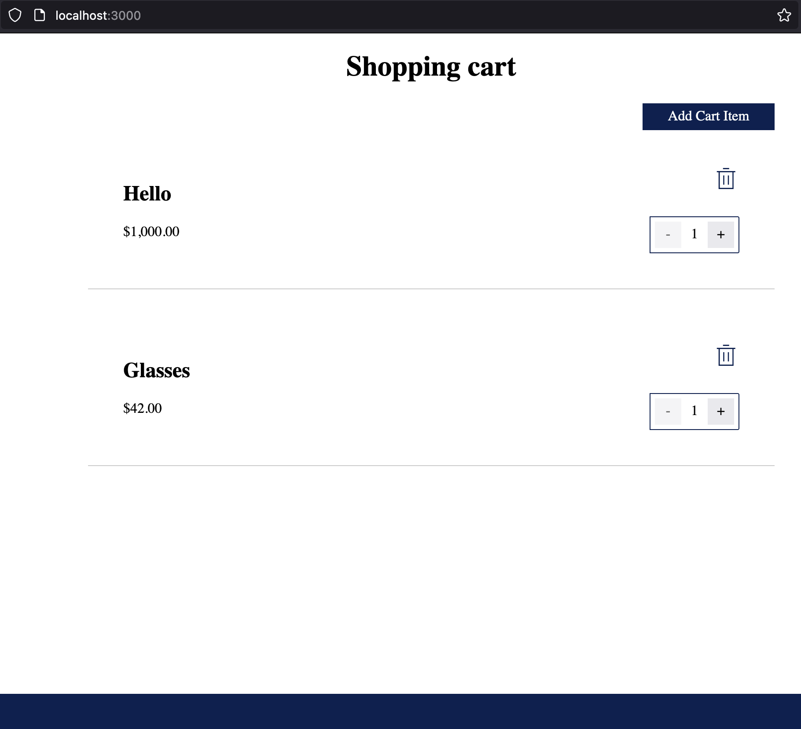
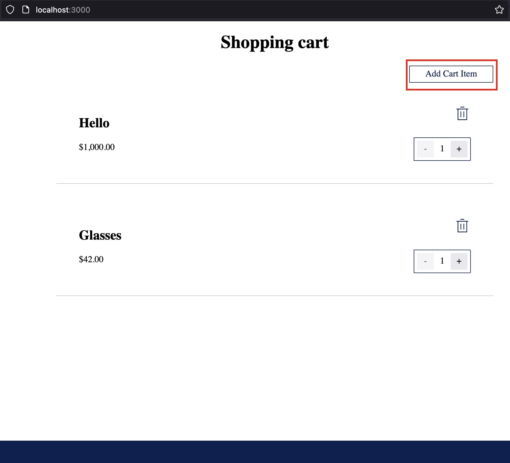
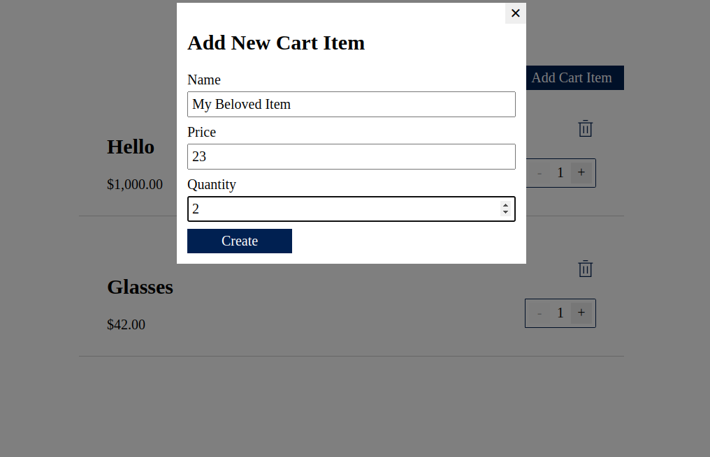
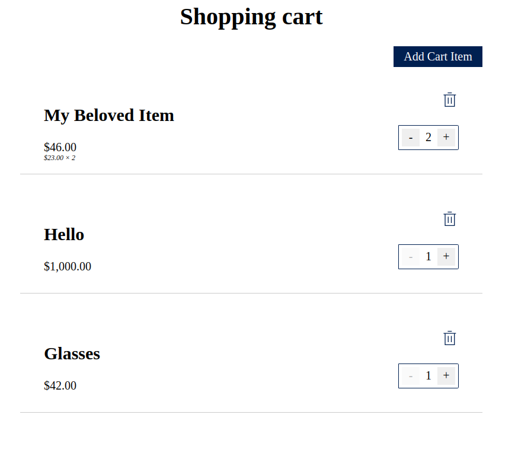
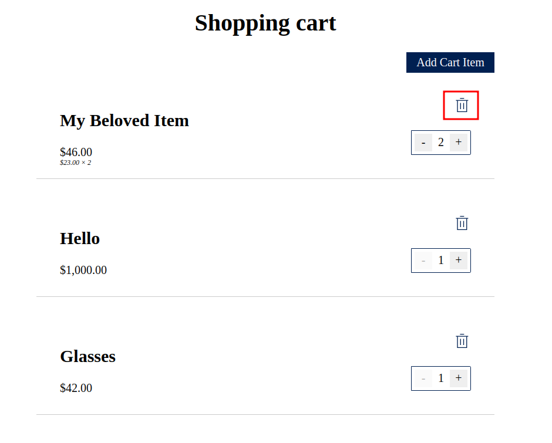

## Homework_1
- Go to the integration folder

```sh
cd integration/
```

- Install dependencies

```sh
yarn
```

- Go to the specs folder

```sh
cd integration/
```

- Install dependencies

```sh
yarn
```

# Test Case:
- Open cart page

  

- Click `Add Cart Item` button

  
 
- Fill all required fields & press `Create`

  
 
- Check that a new product has been added, and all fields (name, price, quantity) are displayed correctly

  

- Delete this item and check that it is not on the page

  