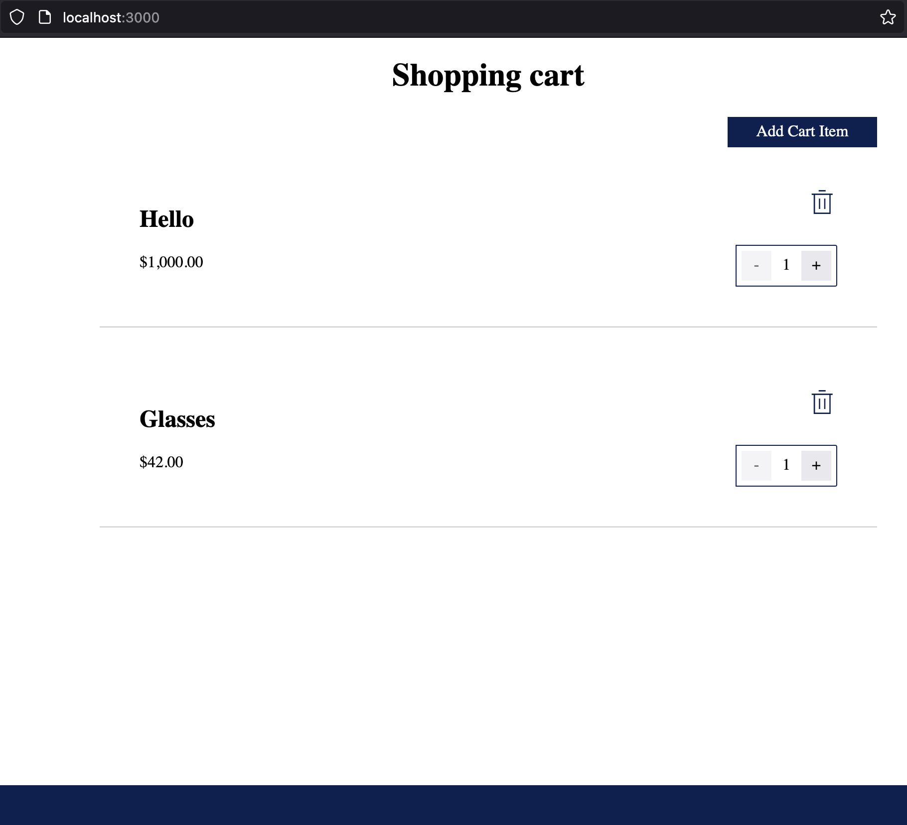
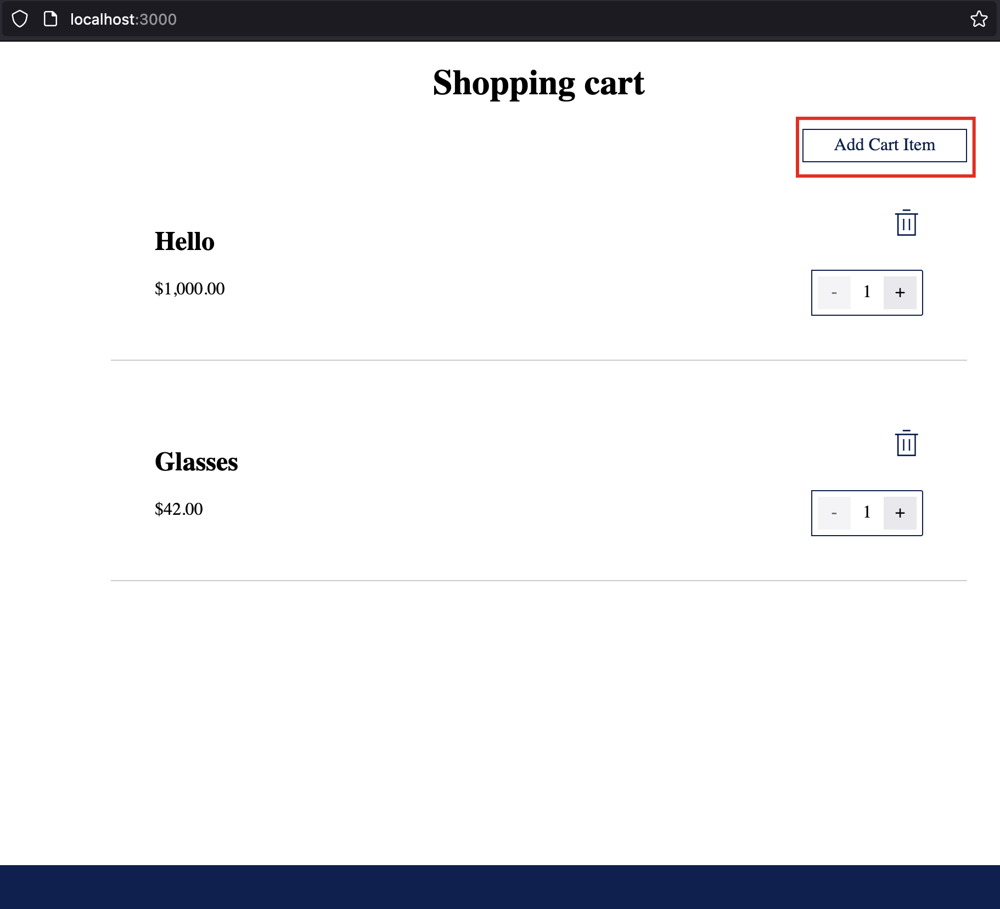

# Test Case:
- Open cart page

  

- Click `Add Cart Item` button

  

- Check event `FormInteraction - Open`
```
{
	name: "FormInteraction"
	value: "Open"
}
```
 
- Fill all required fields & press `Create`

  

- Check event `Add item - 'your item name'`
```
{
	name: "Add item - 'your item name'"
	price: your item price
	quantity: your item quantity
	value: "your item name"
}
```
 
- Check that a new product has been added, and all fields (name, price, quantity) are displayed correctly

  

- Delete this item and check that it is not on the page

  

- Check event `Delete item - 'your item name'`
```
{
	name: "Delete item - 'your item name'"
	value: "your item name"
}
```

- Delete all item from cart & check event `Cart is Empty`
```
{
	name: "Cart is Empty"
	value: "Quantity of products: 0"
}
```